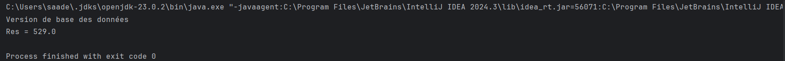
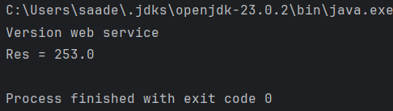
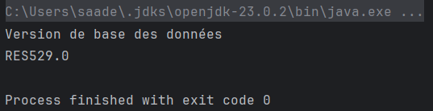
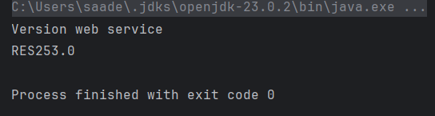
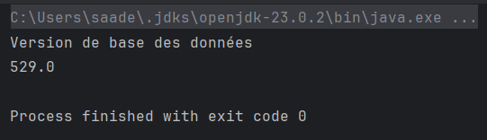
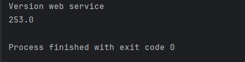

#Injection des Dépendances en Java
Ce projet illustre l'injection de dépendances en Java à travers trois approches :

- Injection statique
- Injection dynamique
- Injection via Spring (XML + Annotations)

##📁 Structure du Projet
```
📂 src
├── 📂 main
│   ├── 📂 java
│   │   ├── 📂 net.outazarube
│   │   │   ├── 📂 dao
│   │   │   ├── 📂 ext
│   │   │   ├── 📂 metier
│   │   │   ├── 📂 pres
│   ├── 📂 resources
├── 📂 test
├── 📂 target
├── .gitignore
├── config.txt
├── pom.xml
```
##🚀 Fonctionnalités Implémentées
✅ Interface ```IDao``` avec méthode ```getData()```
✅ Implémentation ```DaoImpl```
✅ Interface ```IMetier``` avec méthode ```calcul()```
✅ Implémentation ```MetierImpl``` (couplage faible)
✅ Injection par :

Instanciation statique → ```PresentationV1.java```
Instanciation dynamique → ```PresentationV2.java```
Spring (XML) → ```PresSpringXML.java``` + ```config.xml```
Spring (Annotations) → ```PresSpringAnnotation.java```
##🛠️ Exécution
Instanciation statique :

```net.elmabrouk.pres.PresentationV1```
Implementation DAO:



Implementation EXT:



Instanciation dynamique :

```net.elmabrouk.pres.PresentationV2```
Implementation DAO:


Implementation EXT:


Injection via Spring (XML) :

```net.outazarine.pres.PresSpringXML```
Implementation DAO:



Implementation EXT:



Injection via Spring (Annotations) :

```net.outazarine.pres.PresSpringAnnotation```
Implementation DAO:



Implementation EXT:


